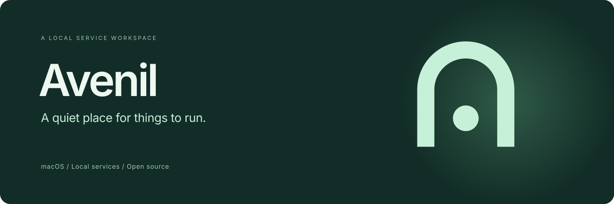
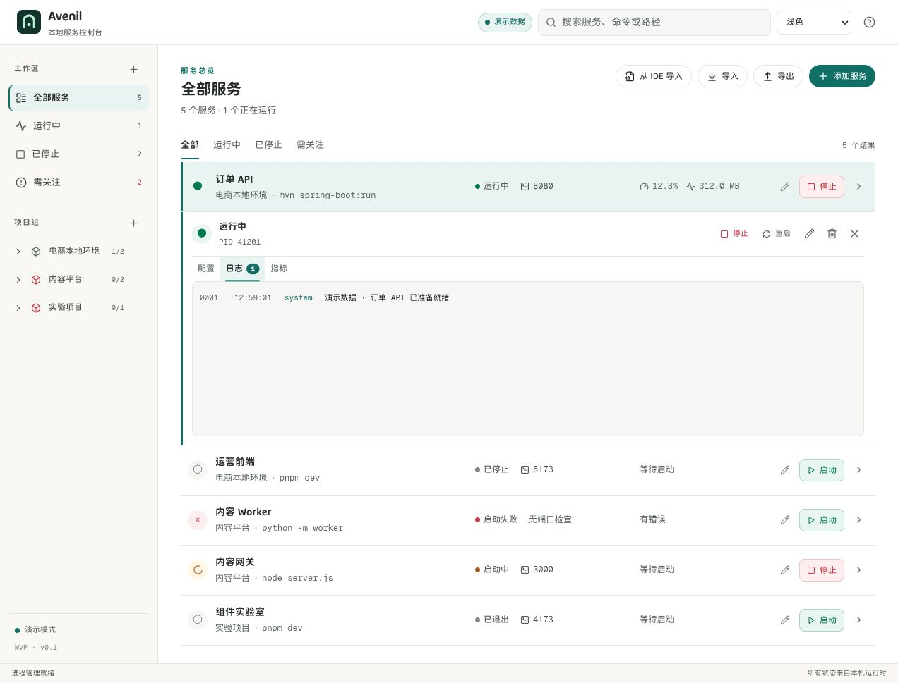
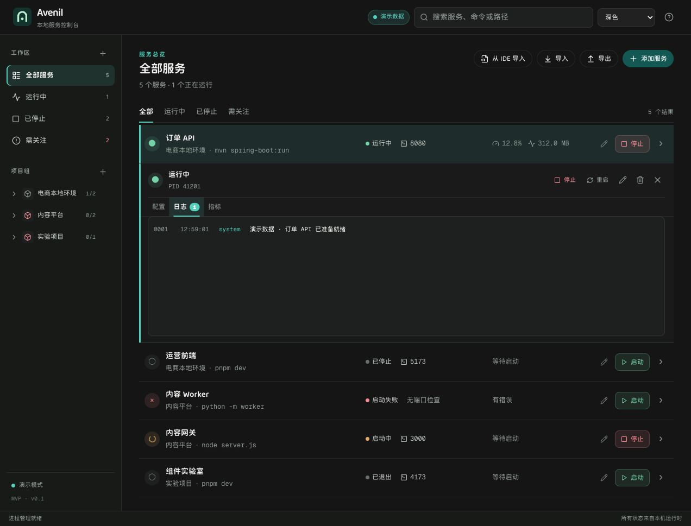

# Avenil — macOS 本地开发服务管理器

Avenil 是一款原生 macOS 应用，用于运行和监控本地开发服务。你可以将前端、API、Worker 等服务按项目分组，一起启动和停止，查看日志与资源占用，检查本地端口，并从 VS Code、Cursor 和 JetBrains 导入运行配置。

<p align="center">
  
</p>

<p align="center">让本地服务有一个安静、清晰的运行空间。<br />集中管理服务、日志与运行状态。</p>

<p align="center">
  <a href="https://github.com/stardut/avenil/releases/latest">下载最新版本</a> ·
  <a href="#下载并运行">下载并运行</a> ·
  <a href="#当前能力">当前能力</a> ·
  <a href="docs/USAGE.md">使用指南</a> ·
  <a href="#参与贡献">参与贡献</a> ·
  <a href="README.md">English</a>
</p>

<p align="center"><strong>macOS 15+ · Apple Silicon · 早期预览 · MIT License</strong></p>



<p align="center"><sub>实际应用界面，使用内置演示数据。当前界面语言为简体中文。</sub></p>

## 下载并运行

Avenil 提供可直接安装的 macOS DMG。[下载最新版本](https://github.com/stardut/avenil/releases/latest)，打开后将 **Avenil** 拖入“**应用程序**”即可。发布包无需安装 Node.js、Rust 或 Xcode。

当前预览版本使用 ad-hoc 签名，macOS 首次启动时可能需要在“**系统设置 → 隐私与安全性**”中手动允许。

如果想直接了解使用方式，可以先看[在 macOS 上管理本地开发服务](docs/guides/manage-local-development-services-on-macos.md)、[导入 IDE 运行配置](docs/guides/import-ide-cursor-jetbrains-run-configurations.md)和[常见本地服务示例](docs/guides/run-common-local-services.md)。

## 适合哪些开发工作流

Avenil 适合需要同时运行多个前台服务的开发者：例如一个前端、一个 API、一个 Worker、本地测试服务或数据库代理。它把这些命令放进按项目组织的原生 macOS 工作区，让你不必为每个服务单独保留一个终端窗口。

如果你正在寻找一款可以在 Mac 上管理多个本地开发服务器、查看服务日志和端口状态，或把项目服务集中到菜单栏中的工具，Avenil 就是为这个工作流设计的。

## 为什么做 Avenil

前端在一个终端，API 在另一个终端，还有一个忘记停止的 Worker。

Avenil 是为这些服务准备的桌面工作区。保存每个服务的工作目录和启动命令，按项目分组，随时查看状态、输出和资源占用。让编辑器专注于写代码，把日常的服务运行管理交给 Avenil。

## 当前能力

- **按项目组织服务**：每个服务拥有独立的工作目录与命令，分组不限制目录结构。
- **控制服务生命周期**：单独或按组启动、停止、重启；管理自己创建的进程组及子进程。
- **集中查看日志**：集中读取 stdout、stderr，支持磁盘日志轮转。
- **查看运行状态**：展示进程数、CPU、内存，支持可选的本地 TCP 就绪检查。
- **导入 IDE 配置**：预览 VS Code、Cursor、JetBrains 中支持的运行配置，确认后添加到新分组。
- **通过 CLI 控制**：桌面应用保持进程唯一所有者，shell 或 AI agent 可以使用同一套服务、分组、配置、日志和资源操作。
- **配置保存在本机**：导出时按当前配置保留环境变量值。
- **适应你的桌面**：浅色、深色、跟随系统主题，以及 macOS 原生窗口控制。

<details>
<summary>查看深色模式</summary>



</details>

## 添加第一个服务

1. 点击 **添加服务**，填写名称和工作目录。
2. 填入平时使用的前台命令，例如 `npm run dev`、`mvn spring-boot:run` 或 `python3 -m http.server 8000`。
3. 按需填写用于就绪检查的端口，以及用于打开浏览器的 URL。
4. 保存后点击 **启动**，展开服务查看日志。

命令应保持前台运行；分组批量操作不包含依赖排序。已有 IDE 运行配置时，可点击 **从 IDE 导入**，选择项目根目录并确认可导入项。

## 使用 CLI

桌面应用会提供一个本机 Unix socket 供 CLI 连接。保持 Avenil 开启（关闭窗口只会隐藏应用），CLI 操作和界面操作使用同一份运行态：

```bash
# 在源码仓库中
npm run cli -- status --json
npm run cli -- start "订单 API"
npm run cli -- logs "订单 API" --limit 100
npm run cli -- logs "订单 API" --search "ERROR" --limit 100
npm run cli -- group restart "电商本地环境"

# 使用已安装的 App：首次启动时选择“安装 CLI”
avenil status --json
```

服务和分组选择器可以使用 UUID 或精确名称；自动化场景使用 `--json`。替换配置、删除服务/分组和退出应用都要求显式传入 `--yes`；配置导出会保留环境变量值。执行 `avenil help`（或 `avenil --help`）查看完整命令列表。socket 只在当前 Mac 本机可用，不是远程控制或网络 API。

`logs` 会读取服务保留的内存日志，以及当前磁盘日志和轮转历史。`--search TEXT` 会在两类日志合并后的结果中按日志正文做大小写敏感的字面量匹配；`--after-seq` 和 `--limit` 仍可用于游标读取和限制输出数量。

首次启动时，Avenil 可以将当前用户专用的 `~/.local/bin/avenil` 软链接安装好，不修改系统目录。之后也可以在 **设置 → CLI** 中再次执行安装，并查看将 `~/.local/bin` 加入 `~/.zprofile` 的准确命令。修改 PATH 后请打开新终端，或执行界面显示的 profile 命令让当前终端生效。

环境变量可以直接通过 `--env KEY=VALUE` 传入，配置中的环境变量值会按原值保存和导出。

## 使用边界

- 仅管理由 Avenil 创建的进程组，不接管已有 PID、系统守护进程或外部后台服务。
- 严格执行配置的 shell、参数和工作目录；默认 shell 为 `/bin/zsh -lc`。
- 可选端口检查连接 `127.0.0.1`，启动期限为 30 秒；这不是 HTTP 健康检查。
- 环境变量覆盖应用继承的环境，不会自动读取 `.env`。
- 本地 JSON 中的环境变量值**没有加密**；导出时按当前配置保留。
- 关闭窗口会直接隐藏应用，Avenil 继续驻留在 macOS 顶部菜单栏；从托盘右键菜单选择“退出”后会先确认，再自动停止托管服务，停止失败时保持应用可用。

配置路径、日志策略、IDE 支持范围与常见问题见 [使用指南](docs/USAGE.md)。

## 范围与方向

以下是待推进的方向，尚未实现，也不代表发布日期承诺：

- [x] 通过版本 tag 触发、可重复的 Apple Silicon DMG 发布流程。
- [ ] Developer ID 签名与 Apple 公证的 macOS 发布包。
- [ ] 英文界面与可维护的多语言结构。
- [ ] 更清晰的首次使用引导和启动错误提示。
- [ ] 根据可复现案例扩大 IDE 配置导入范围。

当前范围聚焦 **macOS 本地前台服务**。Avenil 不是远程主机管理器、容器管理器、调试器或依赖编排工具；远程主机、容器管理、调试器与依赖编排暂不在当前版本范围内。

## 参与贡献

Avenil 是基于 [MIT License](LICENSE) 发布的开源项目。欢迎带来真实的使用场景、可复现的问题、小范围修复、文档改进和设计反馈。开发流程、项目结构与验证方式见[贡献指南](CONTRIBUTING.md)；如果 Avenil 帮你减少了终端管理的负担，也欢迎点一个 Star，让更多人发现它。

<details>
<summary>从源码运行、预览、构建和发布</summary>

如果要参与 Avenil 本身的开发，需要 macOS 15+、Apple Silicon、Xcode Command Line Tools、Rust stable、Cargo，以及 Node.js 20.x 分支至少为 **20.19**、22.x 分支至少为 **22.13**，或使用 24+，并安装 npm。

在项目根目录执行：

```bash
npm ci
npm run tauri dev
```

只体验界面时，可运行 `npm run dev`，然后打开 **http://127.0.0.1:1420/?preview=1**。浏览器预览使用内存中的演示数据，不会读取本机项目文件，也不会管理真实进程。

构建 macOS DMG：

```bash
npm run tauri build
```

默认产物位于 `src-tauri/target/release/bundle/dmg/`。本地构建使用 ad-hoc 签名，未使用 Developer ID 签名或 Apple 公证。

发布版本时，只需要为目标生产提交创建并推送 annotated tag。业务提交不需要提前修改版本文件：tag 是发布版本的唯一来源，工作流会在 CI 临时工作区中同步版本后再构建。仓库当前使用不带 `v` 前缀的 tag：

```bash
git tag -a 0.2.0 -m "Avenil 0.2.0 release"
git push origin 0.2.0
```

`Release macOS app` 工作流会读取 tag，在临时 checkout 中同步 `package.json`、`package-lock.json`、`src-tauri/tauri.conf.json`、`src-tauri/Cargo.toml` 和 `src-tauri/Cargo.lock` 的版本，构建 Apple Silicon DMG，发布到该 tag 对应的 GitHub Release，并确认 Release 中存在 `.dmg` 资产。也可以在 Actions 页面手动输入已有 tag，重新构建或补发 Release。Developer ID 签名与 Apple 公证仍是后续目标。

</details>

## 许可证与致谢

使用 Tauri、Rust、React 和 Vite 构建。改编的 beUI 组件保留 [MIT 声明](THIRD_PARTY_LICENSES/beui-MIT.txt)，Geist 与 Audit Rounded 字体保留[各自的](src/assets/fonts/LICENSE.txt) [OFL 声明](src/assets/fonts/audit-rounded-OFL.txt)。第三方组件仍遵循各自许可证。
